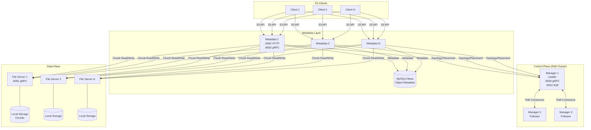
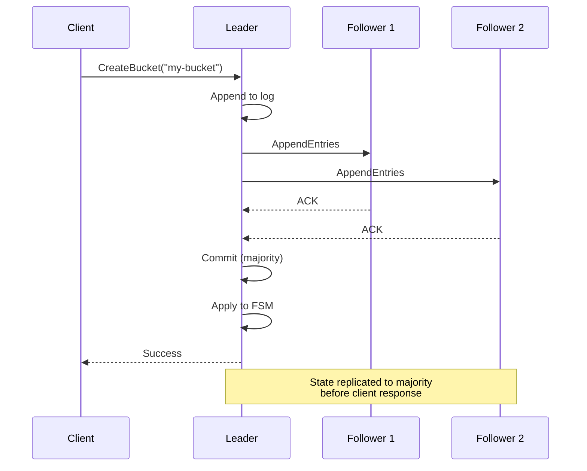
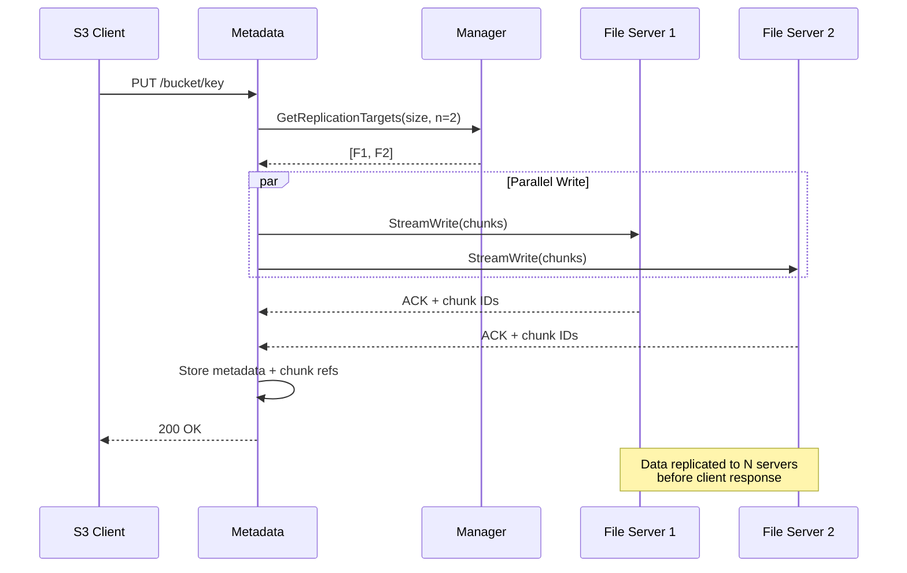
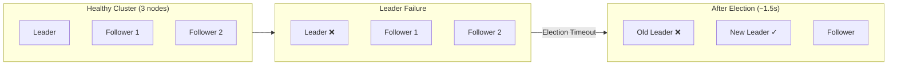
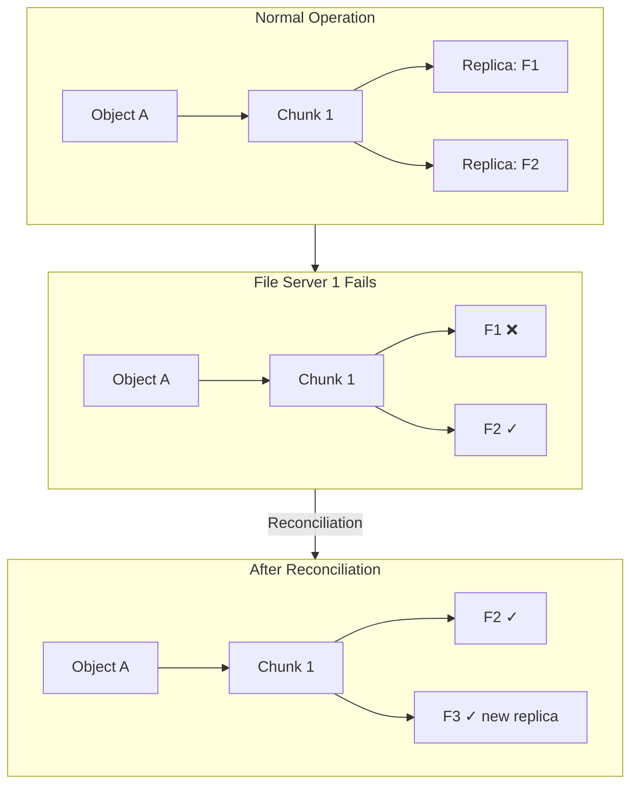
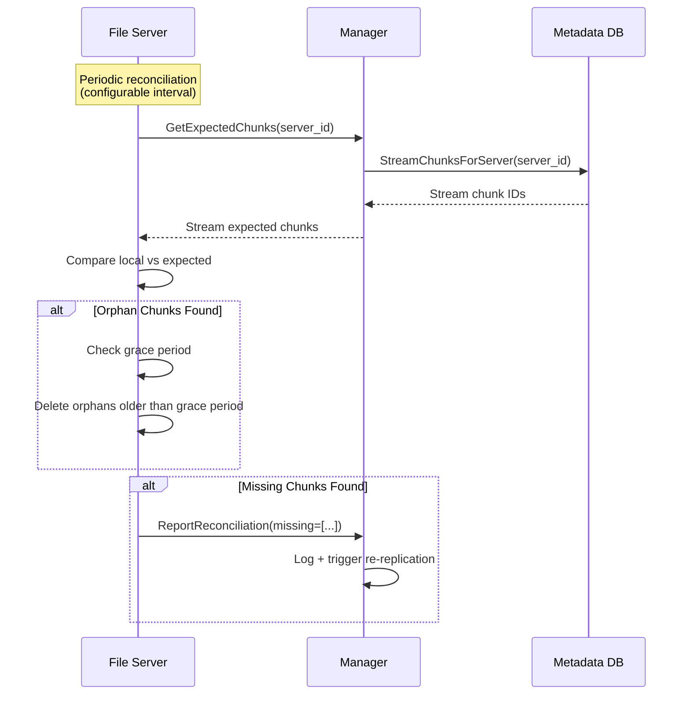
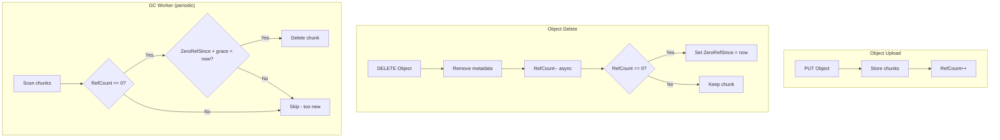
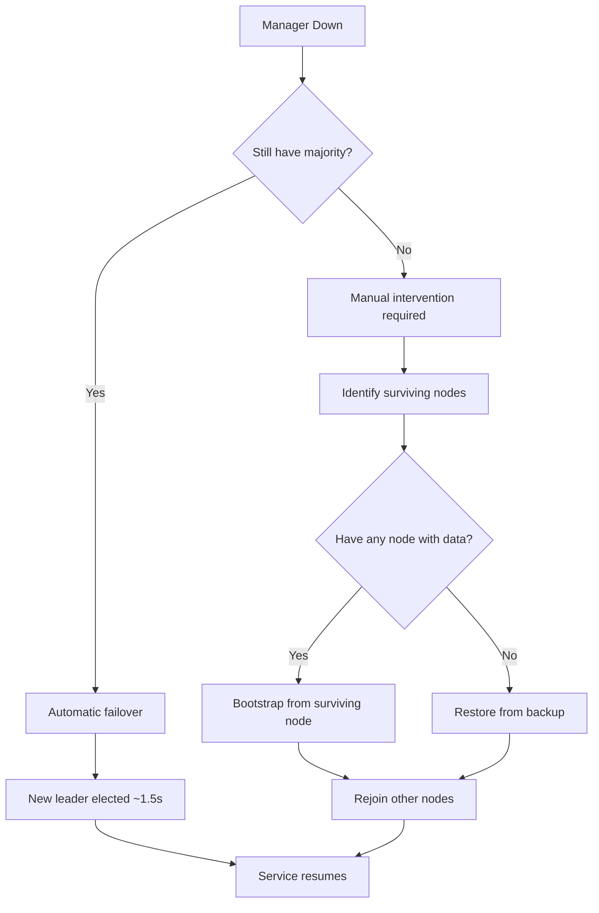
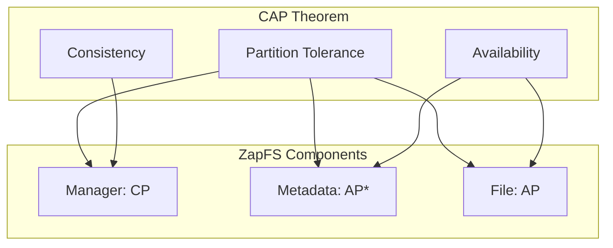

# ZapFS Distributed Systems Design

This document describes the distributed systems principles, consistency guarantees, failure handling, and recovery mechanisms in ZapFS.

## Architecture Overview

ZapFS is a distributed object storage system with three main services:

### Service Roles

| Service | Role | Stateful? | Consistency Model |
|---------|------|-----------|-------------------|
| **Manager** | Control plane: service registry, IAM, placement, collections | Yes (Raft) | Strong (linearizable writes) |
| **Metadata** | S3 API gateway, object metadata, routing | Stateless* | Eventual (caches topology) |
| **File** | Chunk storage, content-hash deduplication | Yes (local) | Eventual (async replication) |

*Metadata services are stateless but rely on MySQL/Vitess for durable metadata.

---

## Consistency Guarantees

### Control Plane: Strong Consistency via Raft

The Manager cluster uses [HashiCorp Raft](https://github.com/hashicorp/raft) for strong consistency:

**Replicated State (via Raft):**
- Service registry (file servers, metadata servers)
- Collections (buckets) and their metadata
- IAM users, credentials, and policies
- Placement policy and replication factors
- Topology version counters

**Guarantees:**
| Property | Guarantee |
|----------|-----------|
| **Writes** | Linearizable - committed to majority before ACK |
| **Reads on Leader** | Linearizable - always current |
| **Reads on Followers** | Potentially stale (use for non-critical reads) |
| **Durability** | BoltDB persistence + 2 snapshots retained |

### Data Plane: Eventual Consistency with Replication

Object data follows an eventually consistent model with configurable replication:

**Replication Model:**
- Configurable replication factor per storage profile (default: 2)
- Synchronous writes to all replicas (no write quorum - all-or-nothing)
- Chunk-level content-hash deduplication
- Reference counting for safe garbage collection

---

## Failure Tolerance

### Manager Failures

| Failure Scenario | Tolerance | Recovery Time |
|------------------|-----------|---------------|
| 1 of 3 managers down | ✅ Survives | Instant (if follower) |
| Leader failure | ✅ Survives | ~1.5s (election timeout) |
| 2 of 3 managers down | ❌ Read-only | Manual recovery |
| All managers down | ❌ Unavailable | Restart from snapshots |

**Leader Election:**
- Heartbeat timeout: ~150ms
- Election timeout: ~1.5s (randomized to prevent split-brain)
- Non-leader requests are forwarded to leader automatically

### File Server Failures

| Failure Scenario | Impact | Recovery |
|------------------|--------|----------|
| 1 file server down | Reads succeed (other replicas) | Automatic re-replication |
| Write during failure | May fail if < replication factor available | Retry with available servers |
| All replicas of chunk lost | **Data loss** | Restore from backup |

### Metadata Server Failures

Metadata servers are stateless - any instance can serve requests:

| Failure Scenario | Impact | Recovery |
|------------------|--------|----------|
| 1 metadata server down | Load balancer routes around | Instant |
| All metadata servers down | S3 API unavailable | Start new instances |
| Database (MySQL) failure | Complete outage | Database HA/failover |

---

## Drift Detection and Reconciliation

ZapFS uses anti-entropy reconciliation to detect and repair data drift between expected state (metadata database) and actual state (file servers).

### Reconciliation Flow

### Drift Scenarios

| Scenario | Detection | Resolution |
|----------|-----------|------------|
| **Orphan chunks** (local but not in metadata) | Reconciliation scan | Delete after grace period (default: 1 hour) |
| **Missing chunks** (in metadata but not local) | Reconciliation scan | Re-replicate from another replica |
| **Stale topology cache** | Version mismatch | Topology push subscription |
| **Split-brain during partition** | Raft prevents writes | Majority side continues; minority stops |

### Grace Periods

Grace periods prevent premature deletion of valid data:

| Component | Grace Period | Purpose |
|-----------|--------------|---------|
| Orphan chunks (reconciliation) | 1 hour (configurable) | Protect in-flight uploads |
| GC (RefCount=0 chunks) | 5 minutes | Protect race conditions |
| ZeroRefSince timestamp | N/A | Track when refcount hit zero |

---

## Garbage Collection

ZapFS uses reference counting with delayed garbage collection:

### GC Safety Properties

1. **Reference Counting**: Chunks are only deleted when RefCount reaches 0
2. **Grace Period**: 5-minute delay after RefCount=0 before deletion
3. **ZeroRefSince Tracking**: Timestamp when chunk became unreferenced
4. **Jittered Scheduling**: GC runs are spread across cluster (15% jitter)
5. **Deduplication Safe**: Same chunk shared by multiple objects (RefCount > 1)

---

## Recovery Procedures

### Manager Cluster Recovery

**Steps for full cluster recovery:**
1. Start one manager with existing data directory (has raft.db + snapshots)
2. The node will bootstrap as single-member cluster
3. Add other managers via `--join <leader-grpc-addr>`
4. Verify cluster health via Raft metrics

### File Server Recovery

| Scenario | Procedure |
|----------|-----------|
| Server restart | Automatic rejoin via manager registration |
| Disk failure | Replace disk, rejoin, reconciliation restores chunks |
| Complete node loss | Add new node, reconciliation triggers re-replication |

### Data Recovery from Missing Chunks

When reconciliation detects missing chunks:
1. Manager logs warning with missing chunk IDs
2. Query `chunk_replicas` table for other servers with the chunk
3. Initiate chunk copy from healthy replica
4. Update chunk registry with new replica location

---

## Observability

### Key Metrics

| Metric | Description |
|--------|-------------|
| `zapfs_raft_state` | Current Raft state (0=Follower, 1=Candidate, 2=Leader) |
| `zapfs_raft_term` | Current Raft term |
| `zapfs_raft_commit_index` | Committed log index |
| `zapfs_raft_leader_changes_total` | Leadership transitions |
| `zapfs_gc_chunks_deleted_total` | Chunks deleted by GC |
| `zapfs_gc_bytes_reclaimed_total` | Storage reclaimed by GC |

### Health Checks

- **Manager**: Ready when leader is elected (`IsClusterReady()`)
- **Metadata**: Ready when connected to database and manager
- **File**: Ready when storage backends initialized

---

## CAP Theorem Trade-offs

ZapFS makes different trade-offs for different components:

| Component | CAP Choice | Explanation |
|-----------|------------|-------------|
| **Manager** | CP | Strong consistency via Raft; unavailable without majority |
| **Metadata** | AP* | Highly available; relies on MySQL for consistency |
| **File** | AP | Available for reads with any replica; eventual consistency |

*Metadata consistency depends on MySQL/Vitess configuration (can be CP with synchronous replication).

---

## Summary

| Aspect | Approach |
|--------|----------|
| **Control plane consistency** | Strong (Raft with majority quorum) |
| **Data replication** | Synchronous to N replicas on write |
| **Read consistency** | Eventual (any replica can serve) |
| **Failure detection** | Service registry heartbeats + Raft timeouts |
| **Drift detection** | Periodic reconciliation scans |
| **Recovery** | Automatic re-replication + manual backup restore |
| **Garbage collection** | Reference counting with grace periods |
